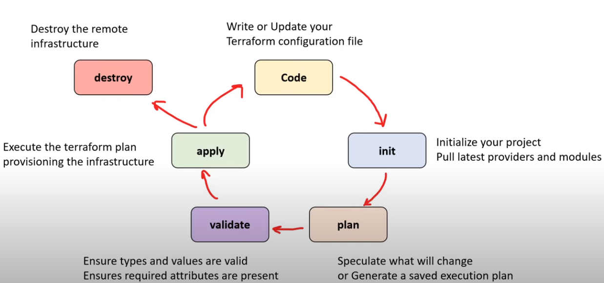

# hashicorp-terraform-associate-certification-notes

## Table of Contents
---
- [Infrastructure as Code](#infrastructure-as-code)
- [What is Hashicorp ?](#what-is-hashicorp)
- [What is Taerraform ?](#what-is-taerraform)

## Reference
- [Terraform official site](https://developer.hashicorp.com/terraform/tutorials/certification-003/associate-review-003)

### Infrastructure as Code
---
- You write a configuration script to <ins> automate creating, updating or destroying <ins>cloud  infrastructure

### Infrastructure Lifecycle
- How does IaC enhance the Infrastructure Lifecycle?
    - Reliability 
        - IaC makes changes <ins>idempotent, consistent, repeatable and predictable</ins>
            - {Idempotent: No matter how many times you run IaC, you will end up with the same state that is expected}
    - Manageability
        - enable mutation via code 
        - revised, with minimal changes
    - Sensibility 
        - avoid financial and reputational losses to even loss of life when considering government and military dependencies on infrastructure

### GitOps
- GitOps is when you take Infrastructure as Code (IaC) and you use a git repository to <ins> introduce a formal process to review and accept changes to infrastructure code,</ins> once that code is accepted, it automatically triggers a deploy

### Immutable Infrastructure Guarantee
- Terraform encourages you towards an immutable Infrastructure architect so you get the following guarantees
- <strong>Cloud Resource Failure</strong> - What if EC2 instance fails a status check?
- <strong> Application Failure </strong> - What if your post installation script fails due to change in package? 
- <strong> Time to Deploy </strong> - What if I need to deploy in a hurray?
- <strong>Worst Case Scenario</strong> -
    - Accidental Deletion
    - Compromised by malicious actor
    - Need to Change Regions (region outrage)

### What is Hashicorp?
- Hashicorp is a company specializing in managed open-source tools used to support the <ins>development and deployment of large-scale service -oriented software installations</ins>
    - What is HAshicorp platform ?
        - HCP is a unified platform to access Hashicorp various products
        - HCP services are cloud agnostic 
        - support for the main cloud service providers (CSPs)
            - e.g AWS, GCP and Azure
        - highly suited for work loads
    
### What is Terraform?
- Terraform is a open-source and cloud-agnostic Infrastructure as Code (IaC) Tool 
- Terraform uses declarative configuration files
- The configuration files are written in Hashicorp Configuration Language (HCL) 
    ### What is Terraform CLoud ?
    - Terraform cloud is a Software as Service (SaaS) offering for:
        - Remote state storage 
        - Version Control integrations 
        - FLexible workflows 
        - Collaborate on Infrastructure changes 
        in a single unified web portal
    ### Terraform Lifecycle
    

    - Change Management 
        - Approach to apply change and resolving conflicts brought about by change
    - Change Automation 
        - automatically creating a consistent, systematic and predictable way of managing change request bia controls and policies
    ### Terraform Resource Graph 
    - Terraform builds a dependency graph from the terraform configurations, and walks this graph to generate plans, refresh state and more
    ### Terraform Core and Terraform Plugins
    - Terraform is logically split into two main parts:
        1. Terraform Core
            - Uses remote procedure calls (RPC) to communicate with Terraform plugins 
        2. Terraform Plugins 
            - expose an implementation for a specific service, or provisioner
    

        